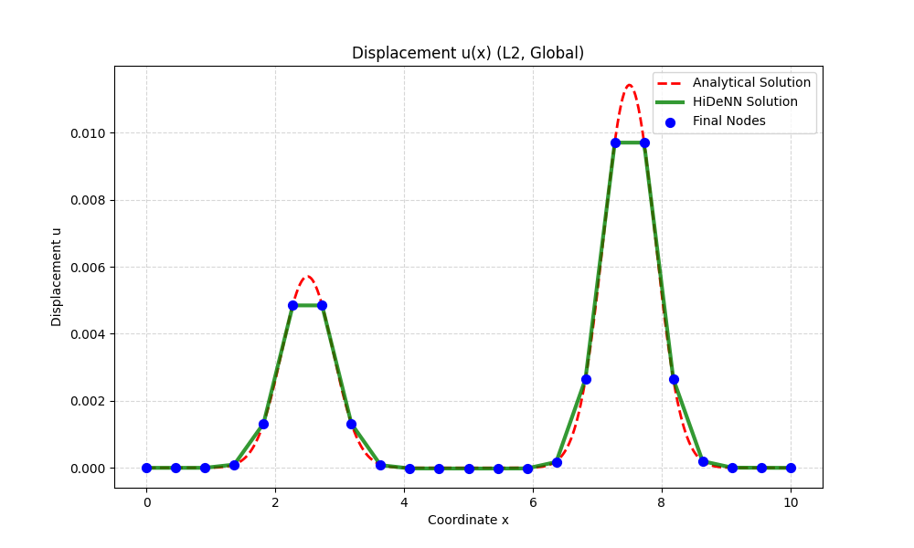
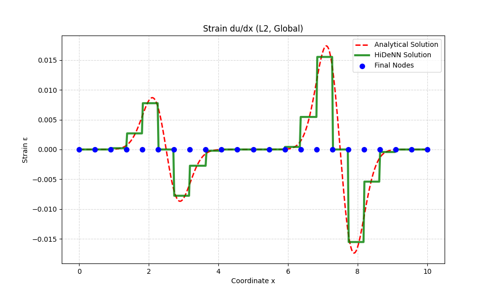
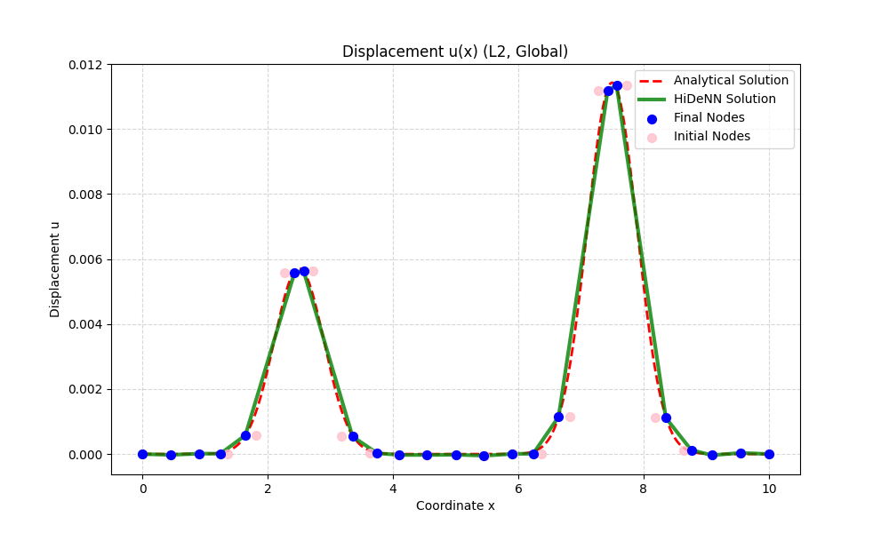
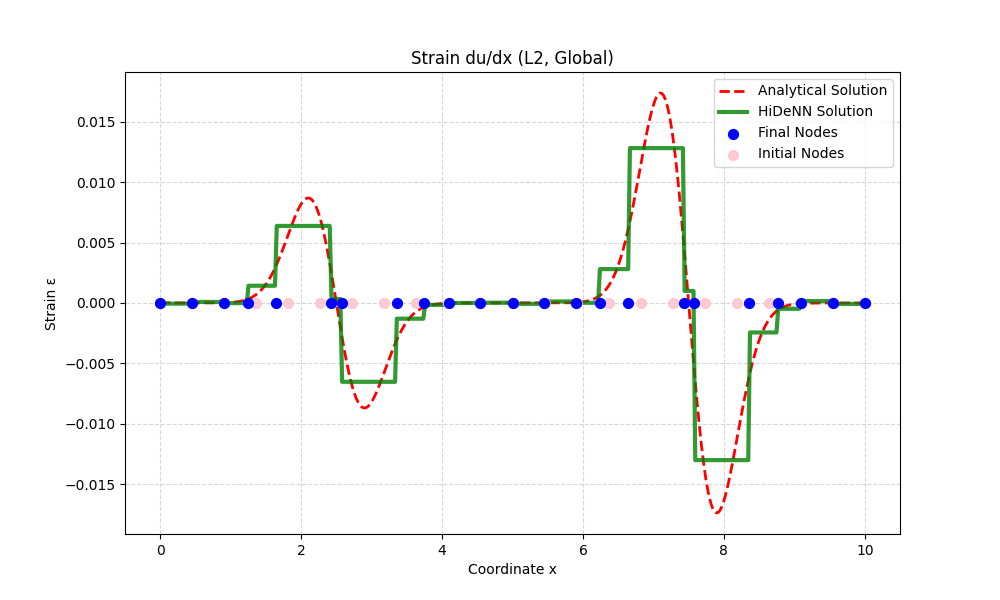

# 1D Neural Network Finite Element Method (HiDeNN)

這個專案使用 **HiDeNN (Hierarchical Deep-learning Neural Networks)** 的概念，實作一個一維有限元素範例，並以 PyTorch 計算位移、應變與應變梯度。

目前專案聚焦在 1D bar 問題，支援不同元素型式、不同積分方法，以及可選的`r-adaptivity` 節點優化。我已完成2D與3D程式碼，由於我的論文還未發表，目前不對外公開。

## Overview

這份實作提供以下能力：

- 支援一次與二次一維元素
- 支援 `Global` 與 `Gauss` 兩種積分策略
- 使用總勢能最小化作為訓練目標
- 可切換固定網格或啟用 `r-adaptivity`
- 輸出位移 `u(x)`、應變 `du/dx`、應變梯度 `d2u/dx2` 與誤差分析

## Theoretical Basis

此專案的核心概念來自以下論文：

> **Zhang, L., Cheng, L., Li, H., Gao, J., Yu, C., Domel, R., Yang, Y., Tang, S., & Liu, W. K. (2020).**  
> *Hierarchical deep-learning neural networks: finite elements and beyond.*  
> **Computational Mechanics**, 67(1), 207-230.  
> DOI: [10.1007/s00466-020-01928-9](https://doi.org/10.1007/s00466-020-01928-9)

### Key Ideas

- **Neural shape functions**  
  以神經網路形式表達 shape functions，同時保留有限元素插值的結構性。

- **Variational formulation**  
  透過總勢能最小化求解：

  ```math
  \Pi(u) = \int \left(\frac{1}{2}EA\left(\frac{du}{dx}\right)^2 - u\,b(x)\right)\,dx
  ```

- **r-adaptivity**  
  除了位移自由度，也可以把內部節點座標視為可訓練參數，讓節點往高梯度區域移動。

## Supported Features

### Element Types

- `L2`: 2-node linear element
- `L3`: 3-node quadratic element

### Integration Methods

- `Global`: 在整個區間上以密集取樣搭配 trapezoidal rule 做積分
- `Gauss`: 逐元素進行 Gaussian quadrature，並處理 parent domain 到 physical domain 的 Jacobian 映射

### Numerical Stability

在 `Gauss` 積分與 `r-adaptivity` 模式下，程式對 Jacobian 接近零的情況加入保護，避免除零或訓練時出現 `NaN`。

## Usage

主要入口為 [`run_1d_study.py`](/d:/lab/NNFEM_1D/run_1d_study.py)。

先在檔案中的 `STUDY_CONFIG` 調整設定，再直接執行：

```bash
python run_1d_study.py
```

### Example Configuration

```python
STUDY_CONFIG = {
    "element_type": "L2",
    "integration_method": "Global",
    "optimizer": "Adam",
    "freeze_mesh": True,
    "num_epochs": 500,
    "learning_rate": 1e-3,
    "lr_coord_scale": 0.1,
    "E": 175.0,
    "A": 1.0,
    "bar_length": 10.0,
    "n_nodes": 23,
    "gauss_order": 5,
    "global_points": 2000,
    "plot_resolution": 400,
}
```

### Important Options

- `element_type`: `L2` 或 `L3`
- `integration_method`: `Global` 或 `Gauss`
- `freeze_mesh`: `True` 為固定網格，`False` 為啟用 `r-adaptivity`
- `optimizer`: 目前主要使用 `Adam`，也保留 `LBFGS` 選項
- `lr_coord_scale`: 啟用 `r-adaptivity` 時，節點座標學習率相對於位移學習率的縮放倍率

## Project Structure

```text
.
|-- run_1d_study.py
`-- src/
    |-- benchmarks/
    |   `-- bar_hard_case.py
    |-- nn_modules/
    |   |-- shape_1d.py
    |   `-- shape_functions_1d.py
    |-- solvers/
    |   `-- hidenn_1d.py
    `-- utils/
        `-- visualization_1d.py
```

### File Guide

- [`run_1d_study.py`](/d:/lab/NNFEM_1D/run_1d_study.py)  
  專案主入口，集中管理 `STUDY_CONFIG`、訓練流程與結果分析

- [`src/solvers/hidenn_1d.py`](/d:/lab/NNFEM_1D/src/solvers/hidenn_1d.py)  
  HiDeNN 一維求解器，包含元素連接、積分流程與能量計算

- [`src/nn_modules/shape_1d.py`](/d:/lab/NNFEM_1D/src/nn_modules/shape_1d.py)  
  `L2` / `L3` 對應的 shape function 模組

- [`src/benchmarks/bar_hard_case.py`](/d:/lab/NNFEM_1D/src/benchmarks/bar_hard_case.py)  
  測試用 1D bar hard case，包括 body force 與解析解

- [`src/utils/visualization_1d.py`](/d:/lab/NNFEM_1D/src/utils/visualization_1d.py)  
  後處理、誤差分析與繪圖工具

## Output

程式執行後會：

- 訓練 HiDeNN 模型
- 計算 `u(x)`、`du/dx`、`d2u/dx2`
- 與解析解比較相對 `L2` 誤差
- 顯示最終節點位置與結果曲線

若啟用 `r-adaptivity`，圖中也會顯示初始節點與最終節點的差異，方便觀察節點是否往高梯度區域集中。

## Example Figure

建議把 README 用的圖片放在 `docs/images/` 下面，例如：

```text
docs/
`-- images/
    `-- result.png
```

然後在 README 中用以下語法插入：

```md

```

範例1 節點固定：





範例2 節點優化：




## Notes

- 使用 `L3` 元素時，`n_nodes` 需要符合三節點元素的配置條件
- 若訓練過程出現 `NaN`，可先降低 `learning_rate` 或 `lr_coord_scale`
- `Global` 積分通常較直觀，`Gauss` 積分則更接近有限元素標準作法
